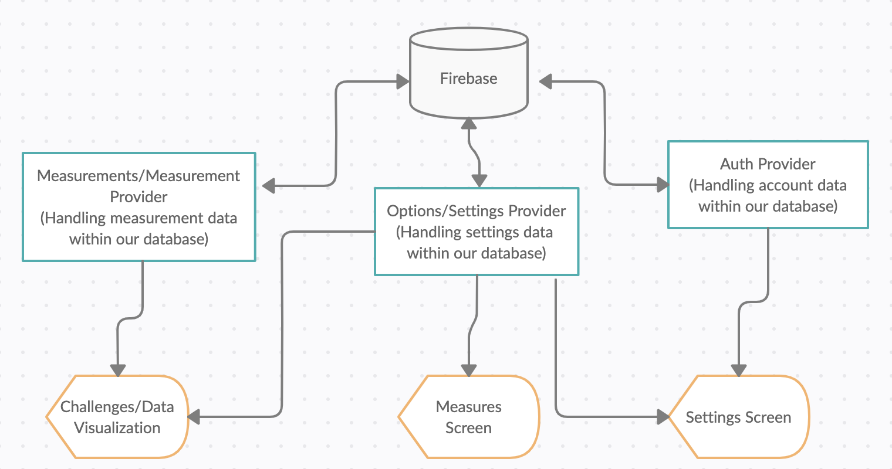

## Technical Documentation

### Database Schema

* See database.txt

### Overall Architecture Design

* We decided to divide our data into three parts, account-specific data (such as email, first name, last name), settings-related data (such as shortcut values), and measurement-related data (such as a user's carb measurements, exercise time, etc., for a certain day). These were divided into the Auth, Settings, and Measurement/Measurements providers. These were used to add and fetch certain data from our database, and used accordingly in the screens that required this data. For instance, in the Settings screen of our app, since we need the user's account information, shortcut information, and the functionality to change these, we made use of the Auth and Settings providers in the Settings screen.

* The reason why we decided to go with this type of Architecture Design was because we felt that it was the best categorization of a user's data, and most of screens use some combination of these categories. This type of design also allows us to divide our front-end code according to what categories of the back-end it utilizes, which gives a sense of order to our code design. 

